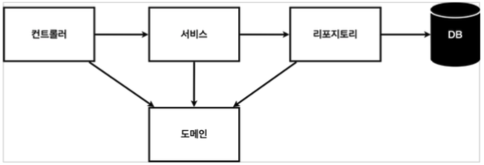
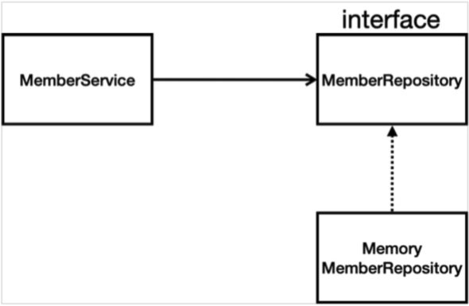

# Chapter 03 "백엔드 개발 - 회원 관리 예제"

## 1. 애플리케이션 구조

### 1.1. 일반적인 웹 애플리케이션 계층 구조

* 컨트롤러: 웹 MVC의 컨트롤러 역할
* 서비스: 핵심 비즈니스 로직 구현
* 리포지토리: 데이터베이스에 접근, 도메인 객체를 DB에 저장하고 관리
* 도메인: 비즈니스 도메인 객체, 주로 데이터베이스에 저장하고 관리됨(예: 회원, 주문, 쿠폰)

### 1.2. 클래스 의존관계


## 2. 회원 도메인과 리포지토리 만들기

### 2.1. 회원 객체 
```java
package hola.springbasic.domain;
  
  public class Member {
      private Long id;
      private String name;
      ...
  }
```

### 2.2. 회원 리포지토리 인터페이스

```java
package hola.springbasic.repository;

import hola.springbasic.domain.Member;

import java.util.List;
import java.util.Optional;

public interface MemberRepository {
    Member save(Member member);
    Optional<Member> findById(Long id); // Optional  - NULL 처리를 위함.
    Optional<Member> findByName(String name);
    List<Member> findAll();
}
```

### 2.3. 회원 리포지토리 메모리 구현체

```java
package hola.springbasic.repository;

import hola.springbasic.domain.Member;

import java.util.HashMap;
import java.util.List;
import java.util.Map;
import java.util.Optional;

/**
 * 아직 데이터 저장소가 선정되지 않아서, 우선 인터페이스로 구현 클래스를 변경할 수 있도록 설계
 */
public class MemoryMemberRepository implements MemberRepository{

    // 동시성 문제가 고려되어 있지 않음, 실무에서는 ConcurrentHashMap, AtomicLong 사용 고려
    // 예제이므로 단순히 HashMap 사용
    private static Map<Long, Member> store = new HashMap<>();
    private static long sequence = 0L;

    @Override
    public Member save(Member member) {
        member.setId(++sequence);
        store.put(member.getId(), member);
        return null;
    }

    @Override
    public Optional<Member> findById(Long id) {
        return Optional.ofNullable(store.get(id));
    }

    @Override
    public Optional<Member> findByName(String name) {
        return store.values().stream()
                .filter(member -> member.getName().equals(name))
                .findAny();
    }

    @Override
    public List<Member> findAll() {
        return ArrayList<>(store.values());
    }
}
```

## 3. 테스트 케이스 작성 - JUnit 프레임워크

### 3.1. 테스트 실행이 필요한 이유<br>- main 메서드나 컨트롤러를 통한 기능 실행의 단점
* 준비하고 실행하는데 오래 걸림
* 반복 실행하기 어려움
* 여러 테스트를 한번에 실행하기 어려움

### 3.2. 회원 리포지토리 메모리 구현체 테스트

* 테스트는 각각 독립적으로 실행되어야 한다. / 모든 테스트의 순서는 보장되지 않는다. <br>
→ 순서 의존적으로 코드 작성하면 안됨.
* `@AfterEach` - 예제에서 ) 테스트 끝나고 data Clear 해주기.
    * 한번에 여러 테스트를 실행하면 메모리 DB에 직전 테스트의 결과가 남을 수 있다. <br>
    → 이전 테스트 때문에 다음 테스트가 실패할 가능성이 있다. 
    * @AfterEach 를 사용하면 각 테스트가 종료될 때 마다 이 기능을 실행한다. 

* 테스트 주도 개발: 테스트 클래스를 먼저 작성한 후 → 구현 클래스 생성

```java
package hola.springbasic.repository;

import hola.springbasic.domain.Member;
import org.junit.jupiter.api.AfterEach;
import org.junit.jupiter.api.Assertions;
import org.junit.jupiter.api.Test;

import java.util.List;

import static org.assertj.core.api.Assertions.assertThat;

public class MemoryMemberRepositoryTest {

    MemoryMemberRepository repository = new MemoryMemberRepository();

    /**
     * 테스트 끝나고 store data 비우기.
     */
    @AfterEach  // 각 테스트 끝난 후 실행
    public void afterEach() {
        repository.clearStore();
    }

    @Test
    public void save(){
        //given
        Member member = new Member();
        member.setName("spring");

        //when
        repository.save(member);

        //then
        Member result = repository.findById(member.getId()).get();
        Assertions.assertEquals(member, result); // import static method
        assertThat(result).isEqualTo(null);
    }

    @Test
    public void findName() {
        //given
        Member member1 = new Member();
        member1.setName("spring1");
        repository.save(member1);

        Member member2 = new Member();  // shift + F6: Rename
        member2.setName("spring2");
        repository.save(member2);

        //when
        Member result = repository.findByName("spring1").get();

        //then
        assertThat(result).isEqualTo(member2);
    }
}
```

## 4. 회원 서비스 개발

* 서비스 - 비지니스 처리

```java
package hola.springbasic.service;

import hola.springbasic.domain.Member;
import hola.springbasic.repository.MemberRepository;
import hola.springbasic.repository.MemoryMemberRepository;

import java.util.List;
import java.util.Optional;

public class MemberService {
    /**
     * 회원 서비스가 메모리 회원 리포지토리를 직접 생성하게 함.
     */
    private final MemberRepository memberRepository = new MemoryMemberRepository();

    /**
     * 회원 가입
     */
    public long join(Member member) {
        //중복 회원 검증, Optional 이기에 가능함.
        /*Optional<Member> result = memberRepository.findByName(member.getName());
        result.ifPresent(m -> {
            throw new IllegalStateException("이미 존재하는 회원입니다.");
        });*/

        /*memberRepository.findByName(member.getName())   // 위에 코드 정리
                .ifPresent(m ->{
                    throw new IllegalStateException("이미 존재하는 회원입니다.");
                });*/

        validateDuplicateMember(member);    // 위에 코드 → option + command + T → extract Methods
        memberRepository.save(member);
        return member.getId();
    }

    private void validateDuplicateMember(Member member) {
        memberRepository.findByName(member.getName())
                .ifPresent(m ->{
                    throw new IllegalStateException("이미 존재하는 회원입니다.");
                });
    }
}
```

## 5. 회원 서비스 테스트

### 5.1. 자동으로 테스트 클래스 작성하기

* 단축키: `command + shift + T` → new Test
* main 과 같은 계층 구조에 생성됨.
* 빌드될 때 테스트 코드는 실제 코드에 포함되지 않으므로, 테스트 메서드는 한글로 작성해도 됨. 


