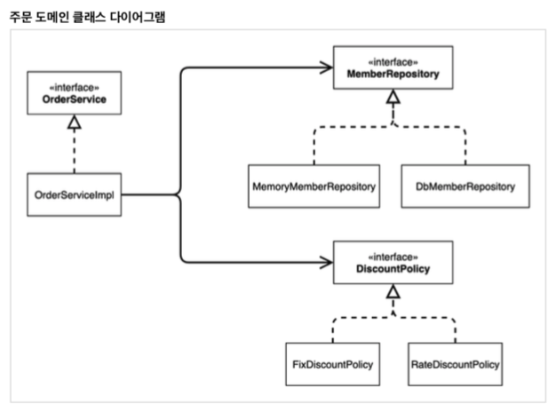

# Chapter 12 "스프링 핵셈 원리 이해 1 - 예제 만들기"

## 1. 프로젝트 생성

* [01. 프로젝트 환경설정](./01.프로젝트환경설정.md) 참고.
* 강의에서는 스프링 없는 순수한 자바로만 개발을 시작하지만, 나는 기존에 생성해둔 스프링 프로젝트를 사용함. (directory 구조 변경함)

## 2. 비즈니스 요구사항과 설계

* 아직 최종 결정되지 않은 정책이 남아있는 상태<br>
→ 인터페이스를 만들고 구현체를 언제든지 갈아끼울 수 있도록 설계 필요.

## 3. 회원 도메인 설계

### 3.1. 회원 도메인 협력 관계

* 클라이언트 → 회원 서비스(가입/조회) → 회원 저장소 인터페이스 (메모리/DB/외부 연동)
* 기획자들도 이해할 수 있는 다이어그램

### 3.2. 회원 클래스 다이어그램


* 구현/개발 level
* 인터페이스와 구현체 포함
* 실제 서버를 실행하지 않고, 클래스만 분석한 단계 (서버 실행 전까지, 어떤 Repository 설정할지 결정 안 한 상태일 수 있음)

### 3.3. 회원 객체 다이어그램(클래스 참조 관계)

* 클라이언트 → 회원 서비스 → 회원 저장소
* 인스턴스 끼리의 참조. 즉, 실제로 서버가 떠서 클라이언트가 실제 사용하는 서비스/리파지토리 포함.

## 4. 회원 도메인 개발

* 회원 엔티티 - 회원 등급(enum)과 회원 엔티티(class) 생성
* 회원 저장소 - 회원 저장소 인터페이스 및 저장소 구현체 생성
* 회원 서비스 - 회원 서비스 인터페이스 및 구현체 생성
    * 관례상, 구현체가 하나만 있을 때에는 Interface 명 뒤에 Impl 붙여서 사용함.

## 5. 회원 도메인 실행과 테스트

* 애플리케이션 로직으로 테스트하는 것은 좋은 방법이 아니므로, JUnit 테스트를 사용하자.
* 테스트 실행이 필요한 이유 - 즉, main 메서드나 컨트롤러를 통한 기능 실행의 단점
    * 준비하고 실행하는데 오래 걸림, 반복 실행하기 어려움(매번 서버 재시동)
    * 여러 테스트를 한번에 실행하기 어려움
    * 새로운 기능이 추가될 때, 서비스의 모든 기능을 테스트할 수는 없음<br>
    → 기존 기능이 잘 작동되는 것을 보장해줌

```java
public class MemberServiceTest {

    MemberService memberService = new MemberServiceImpl();

    @Test
    void join(){
        // given
        Member member = new Member(1L, "memberA", Grade.BASIC);

        // when
        memberService.join(member);
        Optional<Member> findMember = memberService.findMember(1L);

        // then
        Assertions.assertThat(member).isEqualTo(findMember.get());  // optional class에서 내부적으로 갖고있는 값 꺼내기
    }
}
```

## 6. 회원 도메인 설계의 문제점

* 다른 저장소로 변경할 때 OCP 원칙을 잘 준수할까요?
* DIP를 잘 지키고 있을까요?
* 의존관계가 인터페이스 뿐만 아니라 구현까지 모두 의존하는 문제점이 있음!

## 7. 주문과 할인 도메인 설계

### 7.1. 주문 도메인 협력, 역할, 책임

1. 주문 생성: 클라이언트는 주문 서비스에 주문 생성을 요청한다.
2. 회원 조회: 할인을 위해서는 회원 등급이 필요하다. → 주문 서비스는 회원 저장소에서 회원 조회하는 과정이 필요하다.
3. 할인 적용: 주문 서비스는 회원 등급에  따른 할인 여부를 할인 정책에 위임한다.
4. 주문 결과 반환: 주문 서비스는 할인 결과를 포함한 주문 결과를 반환한다.

### 7.2. 주문 클래스 다이어그램

* 역할과 구현을 분리해서 자유롭게 구현 객체를 조립할 수 있게 설계했다.<br>
→ 덕분에 회원 저장소는 물론이고, 할인 정책도 유연하게 변경할 수 있다.<br>
→ `협력 관계를 그대로 재사용 할 수 있다.`



### 3.3. 주문 도메인 다이어그램(클래스 참조 관계)

* (예) 클라이언트 → 주문 서비스 구현체 → DB회원저장소/정액할인정책

## 8. 주문과 할인 도메인 개발

* 할인 정책 인터페이스 & 구현체 (정액 할인 정책으로)
* 주문 엔티티
* 주문 서비스 인터페이크 & 구현체
    * 메모리 회원 리포지토리와, 고정 금액 할인 정책을 구현체로 생성한다.
```java
public class OrderServiceImpl implements OrderService {

    // 구현체 생성 - MemoryMemberRepository 와 FixDiscountPolicy
    // 회원 조회를 위함.
    private final MemberRepository memberRepository = new MemoryMemberRepository();
    // 할인 정책 조회를 위함.
    private final DiscountPolicy discountPolicy = new FixDiscountPolicy();

    @Override
    public Order createOrder(Long memberId, String itemName, int itemPrice) {
        // 스프링 단일 책임 원칙이 잘 구현됨.
        Member member = memberRepository.findById(memberId).get();
        int discountPrice = discountPolicy.discount(member, itemPrice);

        return new Order(memberId, itemName, itemPrice, discountPrice);
    }
}
```

## 9. 주문과 할인 도메인 실행과 테스트

```java
public class OrderServiceTest {

    MemberService memberService = new MemberServiceImpl();
    OrderService orderService = new OrderServiceImpl();

    @Test
    void createOrder(){
        Long memberId = 1L; // primitive type "long"을 쓸 수도 있지만, 해당 변수에는 null이 안들어가므로 Long 사용.
        Member member = new Member(memberId, "memberA", Grade.VIP);
        memberService.join(member);

        Order order = orderService.createOrder(memberId, "itemA", 1000);
        Assertions.assertThat(order.getDiscountPrice()).isEqualTo(1000);
    }
}
```

