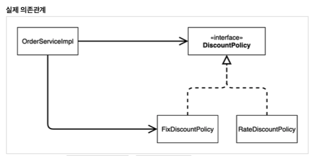
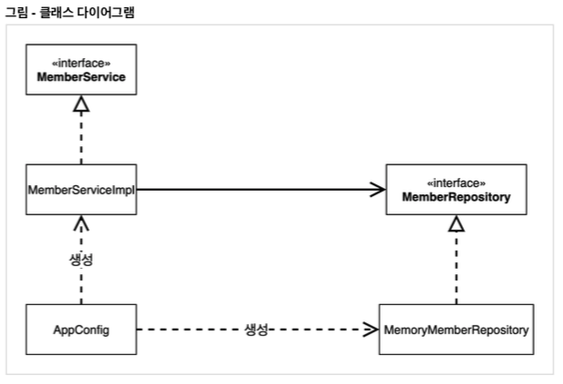

# Chapter 13 "스프링 핵심 원리 이해 2 - 객체 지향 원리 적용"

## 1. 새로운 할인 정책 개발

### 1.1. [애자일 소프트웨어 개발 선언](https://agilemanifesto.org/iso/ko/manifesto.html)

우리는 소프트웨어를 개발하고, 또 다른 사람의 개발을 도와주면서 소프트웨어 개발의 더 나은 방법들을 찾아가고 있다. <br>
이 작업을 통해 우리는 다음을 가치 있게 여기게 되었다:

* 공정과 도구보다 `개인과 상호작용`을
* 포괄적인 문서보다 `작동하는 소프트웨어`를
* 계약 협상보다 `고객과의 협력`을
* 계획을 따르기보다 `변화에 대응하기`를

가치 있게 여긴다.<br>
이 말은, 왼쪽에 있는 것들도 가치가 있지만,<br>
우리는 오른쪽에 있는 것들에 더 높은 가치를 둔다는 것이다.

### 1.2. 새로운 할인 정책을 확장해보자

* 새로운 정률 할인 정책인 RateDiscountPolicy 를 추가하자.


```java
class RateDiscountPolicyTest {

    RateDiscountPolicy discountPolicy = new RateDiscountPolicy();

    @Test
    @DisplayName("VIP는 10% 할인이 적용되어야 한다.")
    void vipSuccess() {
        // given
        Member member = new Member(1L, "memberVIP", Grade.VIP);

        // when
        int discount = discountPolicy.discount(member, 10000);

        // then
        Assertions.assertThat(discount).isEqualTo(1000);
    }

    @Test
    @DisplayName("VIP가 아니면 할인이 적용되지 않아야 한다.")
    void vipFail() {
        // given
        Member member = new Member(1L, "memberBASIC", Grade.BASIC);

        // when
        int discount = discountPolicy.discount(member, 10000);

        // then
        Assertions.assertThat(discount).isEqualTo(0);
    }
}
```

## 2. 새로운 할인 정책 적용과 문제점

### 2.1.  할인 정책을 변경하려면, 클라이언트인 OrderServiceImpl 코드를 고쳐야 함.

* FixDiscountPolicy → RateDiscountPolicy

```java
public class OrderServiceImpl implements OrderService {

    // 구현체 생성 - MemoryMemberRepository 와 FixDiscountPolicy
    // 할인 정책 조회를 위함.
    // private final DiscountPolicy discountPolicy = new FixDiscountPolicy();
    private final DiscountPolicy discountPolicy = new RateDiscountPolicy();
    ...
}
```

### 2.2 문제점 발견

* 역할과 구현을 충실하게 분리함 (YES)
* 다형성 활용, 인터페이스와 구현 객체를 분리함 (YES)
* OCP, DIP 와 같은 객체 지향 설계 원칙을 충실히 준수함 (NO)

#### 2.2.1. DIP - 주문 서비스 클라이언트(OrderServiceImpl)는 DiscountPolicy 인터페이스에 의존하면서 DIP를 지킨 것 같은데?

* 클래스 의존관계 - 추상(인터페이스) 뿐만 아니라 `구체(구현) 클래스에도 의존`하고 있다.
    * 추상(인터페이스) 의존: DiscountPolicy
    * 구체(구현) 클래스: FixDiscountPolicy , RateDiscountPolicy
* 클라이언트인 OrderServiceImpl 이 DiscountPolicy 인터페이스 뿐만 아니라 FixDiscountPolicy 인 구체 클래스도 함께 의존하고 있다. <br>
→ DIP 위반



#### 2.2.2. OCP - 변경하지 않고 확장할 수 있다고 했는데! 

* 그래서 FixDiscountPolicy 를 RateDiscountPolicy 로 변경하는 순간, OrderServiceImpl 의 소스 코드도 함께 변경해야 한다!<br>
→ OCP를 위반
* 지금 코드는 기능을 확장해서 변경하면, 클라이언트 코드에 영향을 준다!

#### 2.2.3. 문제 해결

* 클라이언트 코드인 OrderServiceImpl 은 DiscountPolicy 의 인터페이스 뿐만 아니라 구체 클래스도 함께 의존한다.<br>
그래서 구체 클래스를 변경할 때 클라이언트 코드도 함께 변경해야 한다.
* `DIP 위반` → 추상에만 의존하도록 변경(인터페이스에만 의존)
* 즉, DIP를 위반하지 않도록 인터페이스에만 의존하도록 의존관계를 변경하면 된다.

> 인터페이스에만 의존하도록 설계를 변경하자.

```java
public class OrderServiceImpl implements OrderService {

    // 구현체 생성 - MemoryMemberRepository 와 FixDiscountPolicy
    // 회원 조회를 위함.
    private final MemberRepository memberRepository = new MemoryMemberRepository();
    // 할인 정책 조회를 위함.
    // private final DiscountPolicy discountPolicy = new FixDiscountPolicy();
    // private final DiscountPolicy discountPolicy = new RateDiscountPolicy();
    // 인터페이스에만 의존하도록 코드 변경
    private DiscountPolicy discountPolicy;
...
}
```

```
java.lang.NullPointerException
	at hola.springbasic.order.OrderServiceImpl.createOrder(OrderServiceImpl.java:25)
	at hola.springbasic.order.OrderServiceTest.createOrder(OrderServiceTest.java:21)
	at java.base/java.util.ArrayList.forEach(ArrayList.java:1541)
	at java.base/java.util.ArrayList.forEach(ArrayList.java:1541)
	at com.intellij.rt.junit.IdeaTestRunner$Repeater.startRunnerWithArgs(IdeaTestRunner.java:33)
	at com.intellij.rt.junit.JUnitStarter.prepareStreamsAndStart(JUnitStarter.java:230)
	at com.intellij.rt.junit.JUnitStarter.main(JUnitStarter.java:58)
```

* 실제 Test 실행을 해보면 NPE(null pointer exception)가 발생한다. - 구현체가 없기 때문에!<br>
→ [해결방안] 누군가가 클라이언트인 OrderServiceImpl 에 DiscountPolicy 의 구현 객체를 대신 생성하고 주입해주어야 한다.

## 3. 관심사의 분리

### 3.1. 관심사를 분리하자 (예: 공연과 배우)

* 배우는 본인의 역할인 배역을 수행하는 것에만 집중, 어떤 여자주인공이 선택되더라도 똑같이 공연을 할 수 있어야 함.
* 공연 구성, 배우 섭외 등의 책임을 담당하는 별도의 공연 기획자 필요.
* 배우와 공연 기획자의 책임을 확실히 분리하자.

### 3.2. AppConfig 등장

> 애플리케이션의 전체 동작 방식을 구성(config) 하기 위해<br>
구현 객체를 생성하고 연결하는 책임을 가지는 별도의 설정 클래스를 만들자.<br>
→ AppConfig를 통해서 관심사를 분리하고 구체 클래스를 선택하며, ServiceImpl 구현 객체는 기능을 실행하는 책임만 담당한다.

#### 3.2.1. AppConfig

* 기존에는 MemberServiceImpl 에서 직접 Repository 지정해주었으나, 이제는 AppConfig에서 애플리케이션에 대한 환경 설정을 진행함.
* AppConfig는 애플리케이션의 실제 동작에 필요한 `구현 객체를 생성`
    * MemberServiceImpl
    * MemoryMemberRepository
    * OrderServiceImpl
    * FixDiscountPolicy
* AppConfig는 생성한 객체 인스턴스의 참조(레퍼런스)를 `생성자를 통해서 주입(연결)`
    * MemberServiceImpl → MemoryMemberRepository
    * OrderServiceImpl → MemoryMemberRepository, FixDiscountPolicy

```java
/**
 * 애플리케이션에 대한 환경 설정은 AppConfig 클래스에서 함.
 */
public class AppConfig {

    public MemberService memberService() {
        return new MemberServiceImpl(new MemoryMemberRepository());
    }

    public OrderService orderService() {
        return new OrderServiceImpl(new MemoryMemberRepository(), new FixDiscountPolicy());
    }
}
```

#### 3.2.2. ServiceImpl 구현체에 생성자 주입

* 생성자를 통해서 MemberServiceImpl 구현체에 어떤 Repository를 사용할지 지정해줌.<br>
→ 단지 MemberRepository만 의존, 생성자를 통해 어떤 구현 객체가 주입될지는 알 수 없음.
* MemberServiceImpl 의 생성자를 통해서 어떤 구현 객체를 주입할지는 오직 `외부 AppConfig`에서 결정
* MemberServiceImpl 은 이제부터 `의존관계에 대한 고민은 외부에 맡기고 실행에만 집중`하면 됨.

```java
public class MemberServiceImpl implements MemberService {

    // interface만... 즉, 추상화에만 의존함.
    private final MemoryMemberRepository memberRepository; // = new MemoryMemberRepository();

    // 구현 객체 생성 - 생성자를 통해서 MemberServiceImpl 구현체에 어떤 Repository를 사용할지 지정해줌.
    public MemberServiceImpl(MemoryMemberRepository memberRepository) {
        this.memberRepository = memberRepository;
    }
    ...
}
```

#### 3.2.3. 클래스 다이어그램



* 객체의 생성과 연결은 `AppConfig` 가 담당한다.
* `DIP 완성`: MemberServiceImpl 은 MemberRepository 인 추상에만 의존하면 된다.<br>
→ 이제 구체 클래스를 몰라도 된다.
* `관심사의 분리`: 객체를 생성하고 연결하는 역할과 실행하는 역할이 명확히 분리되었다.
*  appConfig 객체는 memoryMemberRepository 객체를 생성하고 그 참조값을 memberServiceImpl 을 생성하면서 생성자로 전달한다.
* `의존성 주입`: 클라이언트인 ServiceImpl 입장에서 보면 의존관계를 마치 외부에서 주입해주는 것 같음.

#### 3.2.4. 테스트코드 오류 수정

* `@BeforeEach` - 각 테스트를 실행하기 전에 호출됨.

```java
public class MemberServiceTest {

    /**
     * AppConfig 를 사용하도록 변경.
     */
    MemberService memberService; // = new MemberServiceImpl();

    @BeforeEach
    public void beforeEach() {
        AppConfig appConfig = new AppConfig();
        memberService = appConfig.memberService();
    }
    ...
}
```

```java
public class OrderServiceTest {

    MemberService memberService;
    OrderService orderService;

    @BeforeEach
    public void beforeEach() {
        AppConfig appConfig = new AppConfig();
        memberService = appConfig.memberService();
        orderService = appConfig.orderService();
    }
    ...
}
```

## 4. AppConfig 리팩터링
## 새로운 구조와 할인 정책 적용
## 전체 흐름 정리
## 좋은 객체 지향 설계의 5가지 원칙의 적용 3. 스프링 핵심 원리 이해2 - 객체 지향 원리 적용 - IoC, DI, 그리고 컨테이너
## 스프링으로 전환하기

