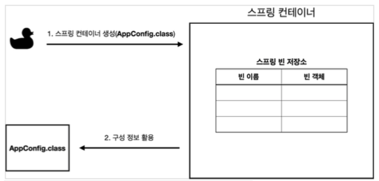
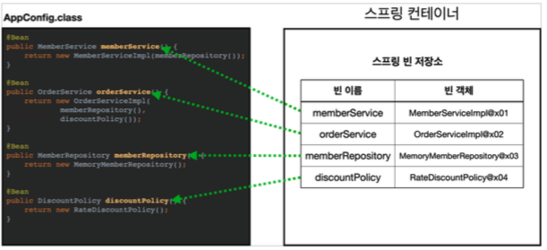
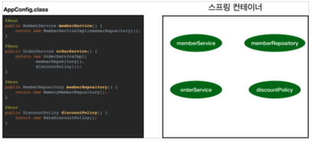
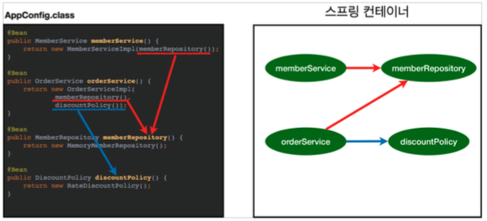
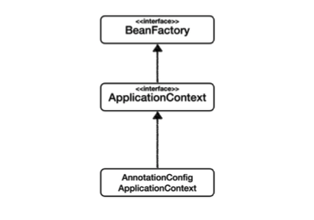
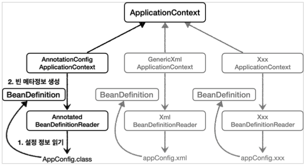

# Chapter 14 "스프링 컨테이너와 스프링 빈"

## 1. 스프링 컨테이너 생성<br>- 자바 설정 클래스를 기반으로 스프링 컨테이너( ApplicationContext )를 만들어보자.

```java
// 스프링 컨테이너 생성!
// annotation 기반으로 하여, AppConfig 클래스의 환경 설정 정보를 가지고 스프링 빈에 등록하겠다는 의미.
ApplicationContext applicationContext = new AnnotationConfigApplicationContext(AppConfig.class);
```

* `ApplicationContext`: 스프링 컨테이너 
    * 정확히는 스프링 컨테이너를 부를 때 BeanFactory, ApplicationContext 로 구분하지만
    * BeanFactory 를 직접 사용하는 경우는 거의 없으므로 일반적으로 ApplicationContext 를 스프링 컨테이너라 한다.
* ApplicationContext 는 인터페이스이다. → 다형성 적용<br>
    * AnnotationConfigApplicationContext 는 ApplicationContext 의 구현체이다.
* 스프링 컨테이너는 XML을 기반으로 만들 수 있고, 애노테이션 기반의 자바 설정 클래스로 만들 수 있다.<br>
최근에는 애노테이션 기반의 설정을 더 많이 사용한다. 

### 1.1. 스프링 컨테이너 생성



```java
// 스프링 컨테이너 생성!
ApplicationContext applicationContext = new AnnotationConfigApplicationContext(AppConfig.class);
```
* 스프링 컨테이너를 생성할 때는 구성 정보를 지정해주어야 한다.(여기서는 AppConfig.class 를 구성 정보로 지정함.)

### 1.2. 설정(구성) 정보를 참고하여 스프링 빈 등록



* 스프링 컨테이너는 파라미터로 넘어온 설정 클래스 정보를 사용해서 스프링 빈을 등록한다. 인스턴스 객체 등록됨.
* Bean 객체가 즉 스프링 Bean임.
* 빈 이름은 기본적으로 메서드 명
    * 직접 부여 - @Bean(name="holaMemberService") 
    * 항상 다른 이름을 부여해야 함. (같은 이름을 부여하면 다른 빈이 무시되거나, 기존 빈을 덮어버리거나, 설정에 따라 오류가 발생한다.)

### 1.2. 스프링 빈 의존관계 설정 - 준비



### 1.2. 스프링 빈 의존관계 설정 - 완료



* 스프링 컨테이너는 설정 정보를 참고해서 의존관계를 주입(DI)한다.
* 객체의 Reference 값들이 연결됨.
* 스프링 빈 생성/의존 관계 주입 단계가 나뉘어져 있지만, 자바 코드로 스프링 빈을 등록하면 생성자를 호출하면서 의존 관계 주입도 한번에 처리된다. (개념적으로 단계를 나누었을 뿐...)

// TODO
* 단순히 자바 코드를 호출하는 것 같지만, 차이가 있다. 이 차이는 뒤에 싱글톤 컨테이너에서 설명한다.

## 2. 컨테이너에 등록된 모든 빈 조회

```java
public class ApplicationContextInfoTest {
    AnnotationConfigApplicationContext ac = new AnnotationConfigApplicationContext(AppConfig.class);

    @Test
    @DisplayName("모든 빈 출력하기")
    void findAllBean() {
        String[] beanDefinitionNames = ac.getBeanDefinitionNames();
        for (String beanDefinitionName : beanDefinitionNames) { // 배열 있을때 iter+tab -> for 문 자동 생성
            Object bean = ac.getBean(beanDefinitionName); // 타입을 모르기 떄문에 Object로 지정
            System.out.println("bean name === " + beanDefinitionName + " object === " + bean);
        }
    }
}
```

```
// 스프링이 내부적으로, 스프링 자체를 확장하기 위해 사용하는 내부 Bean
bean name === org.springframework.context.annotation.internalConfigurationAnnotationProcessor object === org.springframework.context.annotation.ConfigurationClassPostProcessor@64ba3208
bean name === org.springframework.context.annotation.internalAutowiredAnnotationProcessor object === org.springframework.beans.factory.annotation.AutowiredAnnotationBeanPostProcessor@158a3b2e
bean name === org.springframework.context.annotation.internalCommonAnnotationProcessor object === org.springframework.context.annotation.CommonAnnotationBeanPostProcessor@25a6944c
bean name === org.springframework.context.annotation.internalPersistenceAnnotationProcessor object === org.springframework.orm.jpa.support.PersistenceAnnotationBeanPostProcessor@5e1fa5b1
bean name === org.springframework.context.event.internalEventListenerProcessor object === org.springframework.context.event.EventListenerMethodProcessor@6b00f608
bean name === org.springframework.context.event.internalEventListenerFactory object === org.springframework.context.event.DefaultEventListenerFactory@2f17e30d
bean name === appConfig object === hola.springbasic.AppConfig$$EnhancerBySpringCGLIB$$a3fb07ec@324a0017

// 직접 등록한 스프링 Bean
bean name === memberService object === hola.springbasic.member.MemberServiceImpl@63f8276e
bean name === orderService object === hola.springbasic.order.OrderServiceImpl@635572a7
bean name === memberRepository object === hola.springbasic.member.MemoryMemberRepository@736caf7a
bean name === discountPolicy object === hola.springbasic.discount.RateDiscountPolicy@495fac5f
```

* ac.getBeanDefinitionNames() : 스프링에 등록된 모든 빈 이름을 조회
* ac.getBean() : 빈 이름으로 빈 객체(인스턴스)를 조회

```java
    @Test
    @DisplayName("애플리케이션 빈 출력하기")
    void findApplicationBean() {
        String[] beanDefinitionNames = ac.getBeanDefinitionNames();
        for (String beanDefinitionName : beanDefinitionNames) {
            BeanDefinition beanDefinition = ac.getBeanDefinition(beanDefinitionName);
            if (beanDefinition.getRole() == BeanDefinition.ROLE_APPLICATION) {
                Object bean = ac.getBean(beanDefinitionName);
                System.out.println("bean name === " + beanDefinitionName + " object === " + bean);
            }
        }
    }
```
```
bean name === appConfig object === hola.springbasic.AppConfig$$EnhancerBySpringCGLIB$$110e54b@59b38691
bean name === memberService object === hola.springbasic.member.MemberServiceImpl@4ce7fffa
bean name === orderService object === hola.springbasic.order.OrderServiceImpl@495fac5f
bean name === memberRepository object === hola.springbasic.member.MemoryMemberRepository@1e636ea3
bean name === discountPolicy object === hola.springbasic.discount.RateDiscountPolicy@6127a7e
```

* getRole() - 스프링이 내부에서 사용하는 빈은 제외하고, 내가 등록한 빈만 출력해보자
    * ROLE_APPLICATION : 일반적으로 사용자가 정의한 빈 
    * ROLE_INFRASTRUCTURE : 스프링이 내부에서 사용하는 빈

## 3. 스프링 빈 조회 - 기본

* ac.getBean(빈이름, 타입)
* ac.getBean(타입)
* 조회 대상 스프링 빈이 없으면 예외 발생
    * NoSuchBeanDefinitionException: No bean named 'xxxxx' available

```java
class ApplicationContextBasicFindTest { // junit5 에서는 더이상 public이 없어도 동작 가능.
    AnnotationConfigApplicationContext ac = new AnnotationConfigApplicationContext(AppConfig.class);

    @Test
    @DisplayName("빈 이름으로 조회")
    void findBeanByName() {
        MemberService memberService = ac.getBean("memberService", MemberService.class);
        System.out.println("memberService === " + memberService);   // hola.springbasic.member.MemberServiceImpl@4ce7fffa
        System.out.println("memberService === " + memberService.getClass());    // class hola.springbasic.member.MemberServiceImpl
        assertThat(memberService).isInstanceOf(MemberServiceImpl.class);
    }

    @Test
    @DisplayName("이름 없이 타입만으로 조회")
    void findBeanByType() {
        MemberService memberService = ac.getBean(MemberService.class);  // 이름 없이, 타입으로만 조회
        System.out.println("memberService === " + memberService);
        System.out.println("memberService === " + memberService.getClass());
        assertThat(memberService).isInstanceOf(MemberServiceImpl.class);
    }

    @Test
    @DisplayName("인터페이스가 아닌, 구체 타입으로 조회")
    // 구현에 의존하므로 유연성이 떨어짐.
    void findBeanByName2() {
        MemberServiceImpl memberService = ac.getBean("memberService", MemberServiceImpl.class);
        System.out.println("memberService === " + memberService);
        System.out.println("memberService === " + memberService.getClass());
        assertThat(memberService).isInstanceOf(MemberServiceImpl.class);
    }

    @Test
    @DisplayName("없는 빈 이름으로 조회")
    void findBeanByNameX() {
        // org.springframework.beans.factory.NoSuchBeanDefinitionException: No bean named 'xxxxx' available
//        MemberService xxxxx = ac.getBean("xxxxx", MemberService.class); //

        assertThrows(NoSuchBeanDefinitionException.class,
                () -> ac.getBean("xxxxx", MemberService.class));    // 무조건 예외가 발생해야 함.
    }
}
```


## 4. 스프링 빈 조회 - 동일한 타입이 둘 이상

* 타입으로 조회시 같은 타입의 스프링 빈이 둘 이상이면 오류가 발생한다.<br>
→ 이때는 빈 이름을 지정하자. 
* ac.getBeansOfType() 을 사용하면 해당 타입의 모든 빈을 조회할 수 있다. 
    * Map형으로 출력(key, value)
    * autowired 등 자동으로 의존 관계 주입할때, 위 기능 유용하다.

```java
class ApplicationContextSameBeanFindTest {

    /**
     * Test 를 위한 Config Class
     */
    @Configuration
    static class SameBeanConfig {
        @Bean
        public MemberRepository memberRepository1() {
            return new MemoryMemberRepository();
        }

        @Bean
        public MemberRepository memberRepository2() {
            return new MemoryMemberRepository();
        }
    }

    AnnotationConfigApplicationContext ac = new AnnotationConfigApplicationContext(SameBeanConfig.class);

    @Test
    @DisplayName("타입으로 조회시 같은 타입이 둘 이상 있으면, 중복 오류가 발생한다")
    void findBeanByTypeDuplicate() {
//        MemberRepository bean = ac.getBean(MemberRepository.class);
        // No qualifying bean of type 'hola.springbasic.member.MemberRepository' available: expected single matching bean but found 2: memberRepository1,memberRepository2
        assertThrows(NoUniqueBeanDefinitionException.class,
                () ->  ac.getBean(MemberRepository.class));
    }

    @Test
    @DisplayName("타입으로 조회시 같은 타입이 둘 이상 있으면, 빈 이름을 지정하면 된다")
    void findBeanByName() {
        MemberRepository memberRepository = ac.getBean("memberRepository1", MemberRepository.class);
        assertThat(memberRepository).isInstanceOf(MemberRepository.class);
    }

    @Test
    @DisplayName("특정 타입을 모두 조회하기")
    void findAllBeanByType() {
        Map<String, MemberRepository> beansOfType = ac.getBeansOfType(MemberRepository.class);
        for (String key : beansOfType.keySet()) {
            System.out.println("key = " + key + " value = " + beansOfType.get(key));
        }
        System.out.println("beansOfType = " + beansOfType);
        assertThat(beansOfType.size()).isEqualTo(2);
    }
}
```

## 5. 스프링 빈 조회 - 상속 관계

* 부모 타입으로 조회하면, 자식 타입도 함께 조회된다. <br>
* 그래서, 모든 자바 객체의 최고 부모인 Object 타입으로 조회하면, 모든 스프링 빈을 조회한다.

## 6. BeanFactory와 ApplicationContext



### 6.1. BeanFactory

* 스프링 컨테이너의 최상위 인터페이스
* 스프링 빈을 관리하고 조회하는 역할, `getBean()` 제공
* 지금까지 우리가 사용했던 대부분의 기능은 BeanFactory가 제공하는 기능

### 6.2. ApplicationContext

* BeanFactory 기능을 모두 상속받아서 제공한다.
* 빈을 관리하고 검색하는 기능을 BeanFactory가 제공해주는데, 그러면 둘의 차이가 뭘까?<br>
: 애플리케이션을 개발할 때는 빈은 관리하고 조회하는 기능은 물론이고, 수 많은 부가기능이 필요하다.

### 6.3. ApplicationContext가 제공하는 부가기능

```java
public interface ApplicationContext extends EnvironmentCapable, ListableBeanFactory, HierarchicalBeanFactory, MessageSource, ApplicationEventPublisher, ResourcePatternResolver {...}
```

* 메시지소스를 활용한 국제화 기능 - 예를 들어서 한국에서 들어오면 한국어로, 영어권에서 들어오면 영어로 출력 
* 환경변수 - 로컬, 개발, 운영등을 구분해서 처리 
* 애플리케이션 이벤트 - 이벤트를 발행하고 구독하는 모델을 편리하게 지원
* 편리한 리소스 조회 - 파일, 클래스패스, 외부 등에서 리소스를 편리하게 조회

### 6.4. Summary

* ApplicationContext는 BeanFactory의 기능을 상속받는다.
* ApplicationContext는 빈 관리기능 + 편리한 부가 기능을 제공한다.
* BeanFactory를 직접 사용할 일은 거의 없고, 부가기능이 포함된 ApplicationContext를 사용한다. 
* BeanFactory나 ApplicationContext를 스프링 컨테이너라 한다.

## 7. 다양한 설정 형식 지원 - 자바 코드, XML

## 8. 스프링 빈 설정 메타 정보 - BeanDefinition

* 스프링은 어떻게 이런 다양한 설정 형식을 지원하는 것일까? 그 중심에는 `BeanDefinition` 이라는 추상화가 있다.
* 쉽게 이야기해서, `역할과 구현을 개념적으로 나눈 것이다!`
    * XML을 읽어서 BeanDefinition을 만들면 된다.
    * 자바 코드를 읽어서 BeanDefinition을 만들면 된다.
    * 스프링 컨테이너는 자바 코드인지, XML인지 몰라도 된다. 오직 BeanDefinition만 알면 된다.
* `BeanDefinition` 을 빈 설정 메타정보라 한다.
    * `@Bean`, `<bean>` 당 각각 하나씩 메타 정보가 생성된다.
* 스프링 컨테이너는 이 메타정보를 기반으로 스프링 빈을 생성한다. (추상화에만 의존함)



```java
public class AnnotationConfigApplicationContext extends GenericApplicationContext implements AnnotationConfigRegistry {

	private final AnnotatedBeanDefinitionReader reader;

	private final ClassPathBeanDefinitionScanner scanner;
...
}
```

* AnnotationConfigApplicationContext 는 AnnotatedBeanDefinitionReader 를 사용해서 AppConfig.class 를 읽고 BeanDefinition 을 생성한다.
* GenericXmlApplicationContext 는 XmlBeanDefinitionReader 를 사용해서 appConfig.xml 설정 정보를 읽고 BeanDefinition 을 생성한다.
* 새로운 형식의 설정 정보가 추가되면, XxxBeanDefinitionReader를 만들어서 BeanDefinition 을 생성 하면 된다.


